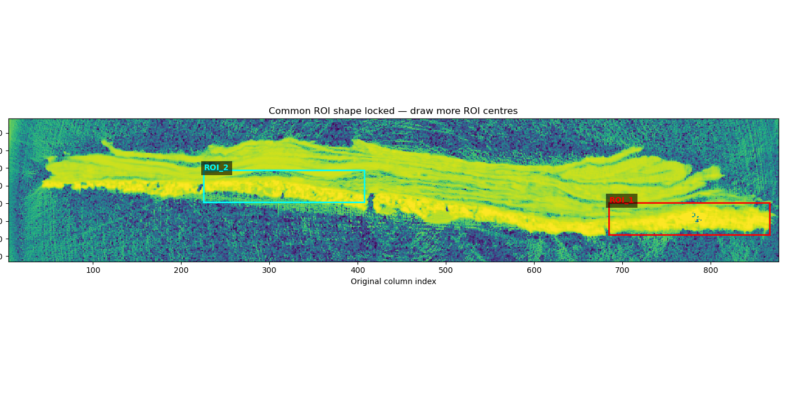
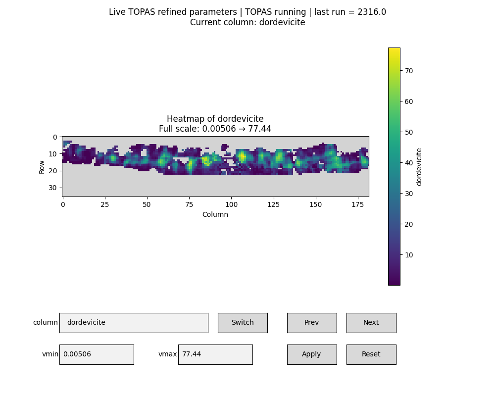

# ID11 XRD-CT Batch Refinement


*The ROI region selected on the total-intensity map (Step 1 output).*

Pipeline for turning a large ESRF **ID11** X-ray Diffraction Computed Tomography (XRD-CT) reconstruction into a quality-filtered batch of per-pixel `.xy` diffraction patterns, ready for automated (TOPAS) profile/Rietveld refinement.

## Concept

XRD-CT reconstructs a 2D map of a sample where **every pixel holds a full 1D diffraction pattern** (intensity vs. 2θ) instead of a single grey value. That means you can see not just the shape of a sample, but which crystalline phase sits at every point in it — for example, which pigment occupies each pixel of a cross-sectioned paint sample (the case this pipeline was built for).

The catch is scale. A modest 893 × 893 spatial map with 1500 2θ points is already a multi-gigabyte array — too large to load fully into RAM, and far too large to Rietveld-refine pixel-by-pixel in one pass. This folder is the ID11-specific workflow for going from that raw reconstruction to a manageable, quality-checked set of per-pixel patterns:

```
recon.h5 (full XRD-CT volume, GB-scale)
        │
        ▼
1. id11_inspectionn.ipynb   → inspect, define phase maps, select & save ROIs
        │  saves ROI_*.npz
        ▼
2. plot_roi_id11.ipynb      → browse saved ROIs, optionally 2×2 bin, export .xy
        │  saves grouped/ungrouped .xy patterns
        ▼
3. id11_FLAGandSAVE.ipynb   → flag low-intensity pixels, save validated ROI data,
        │                      export only valid .xy patterns + per-ROI average
        ▼
per-pixel .xy files ──► TOPAS batch refinement (see ../../batchrefinement)
```

## Files in this folder

| File | Role |
|---|---|
| [`id11_inspectionn.ipynb`](./id11_inspectionn.ipynb) | **Step 1.** RAM-safe inspection of the raw XRD-CT reconstruction; define chemical-phase maps and spatial ROIs; save ROI data to `.npz`. |
| [`plot_roi_id11.ipynb`](./plot_roi_id11.ipynb) | **Step 2.** Browse saved ROIs pixel-by-pixel or by rectangle, optionally 2×2 spatially bin them, and export every pattern as a headerless `.xy` file. |
| [`id11_FLAGandSAVE.ipynb`](./id11_FLAGandSAVE.ipynb) | **Step 3.** Flag and discard low-signal pixels using an interactive threshold, save "validated" ROI data, export only the valid `.xy` patterns, and compute one filtered average pattern per ROI. |
| `pigment.png` | The ROI region selected on the sample's total-intensity map (Step 1 output). |
| `ROI-1 Filter.png`, `ROI-2 Filter.png` | Intensity maps for ROI 1 and ROI 2 **after thresholding** (Step 3) — flagged/invalid pixels highlighted. |
| `refining.png` | TOPAS batch refinement running on the exported `.xy` patterns (Step 4). |

## 1. `id11_inspectionn.ipynb` — inspect the reconstruction & define ROIs

Works directly on the HDF5 reconstruction (`recon_path`, default `/recon`) and its 2θ axis (`twotheta_path`, default `/tth`) **without ever loading the full volume into RAM** — it reads shape/axis metadata once, then streams the detector data in `THETA_CHUNK`-sized slices for every computation.

What it does, cell by cell:
- **Total-intensity map** — sums intensity over all 2θ points, in chunks, to give a quick overview image of the whole scan.
- **Pixel / rectangular-ROI pattern viewer** — click a pixel (or drag a rectangle) on the map to pull just that one pattern (or the mean/sum over the rectangle) straight from disk.
- **Phase-ROI composite map** — pick one or more 2θ ranges ("phases") on the average pattern; for each one, sums (optionally net of a linear background between the ROI endpoints) the intensity in that range across the whole map, and overlays the results as an RGB composite, one color per phase.
- **Equal-size spatial ROI selection** — draw rectangular regions of interest on the map (e.g. `ROI_1`, `ROI_2`, one per pigment/layer of interest). The **first** ROI you draw fixes the height/width (rounded up to even numbers) for every ROI after it, so all ROIs end up the same shape. Saves each one to `<prefix>_<NN>_<name>.npz`, containing the full per-pixel diffraction stack for that ROI plus the index mapping back to the original scan coordinates.

**Edit before running:** `folder_path` / `scan_path` (your `.h5` reconstruction), `recon_path`, `twotheta_path`, `THETA_CHUNK` (lower it if you're still RAM-limited), and the ROI `save_folder_box` / `file_prefix_box` in the UI.

## 2. `plot_roi_id11.ipynb` — browse, bin, and export ROI patterns

Loads the `.npz` files saved in Step 1 (`roi_folder`) and gives you two ways to explore them:

- **Original resolution** — click a pixel or draw a rectangle (mean or sum) to see its diffraction pattern next to the ROI's total-intensity map, with Previous/Next buttons to step through ROI files.
- **2×2 spatial binning** — combines every 2×2 pixel block (mean or sum) before display, to trade spatial resolution for signal-to-noise.

It then exports **every pixel's pattern** as a two-column, headerless `.xy` file (`2theta  intensity`), in two flavors:
- `grouped_data_id11/` — 2×2-binned patterns
- `ungrouped_data_id11/` — original, unbinned patterns

Each ROI gets its own numbered subfolder, and each file is named with its row/column and a flat pixel index, e.g. `pap_bin2x2_r003_c012_idx00234.xy`.

## 3. `id11_FLAGandSAVE.ipynb` — flag, filter, and average

Adds a quality-control pass on top of the saved ROIs:

- **Validation metric**: for every pixel, sum the intensity over the *entire* 2θ range: `S(r, c) = Σ I(2θ, r, c)`. A pixel is marked **invalid** if `S(r, c) ≤ threshold` or its data aren't finite — i.e. it's essentially background/no-signal.
- **Interactive threshold**: a log-scale histogram of pixel sums lets you click to set the threshold live; the filtered map instantly re-colors invalid pixels red so you can see the effect before committing.
- **Unbinned and binned validation are independent** — a pixel can be valid in one representation and not the other, since the threshold is computed on different underlying data. Results are saved to separate folders.
- **Save validated `.npz`** — same format as Step 1's output, but invalid pixels' patterns are replaced with `NaN` (`validated_unbinned_npz_id11/`, `validated_binned_npz_id11/`).
- **Export valid `.xy` only** — same naming scheme as Step 2, but invalid pixels are skipped entirely, so gaps in the `idx` numbering mark rejected points (`validated_unbinned_xy_id11/`, `validated_binned_xy_id11/`).
- **Per-ROI filtered average** — averages all *valid* pixels within each ROI into one representative `.xy` pattern per ROI (`average_filtered_patterns_id11/`), useful as a fast single-pattern check before committing to full per-pixel batch refinement.

`ROI-1 Filter.png` and `ROI-2 Filter.png` below show the result of this thresholding step — each ROI's map after invalid pixels have been flagged:

<p align="center">
  
  
</p>

## 4. TOPAS batch refinement

The `.xy` patterns exported in Steps 2 and 3 are the input for batch profile/Rietveld refinement in TOPAS (see the top-level [`batchrefinement/`](../batchrefinement) folder). `refining.png` shows this refinement running on the exported patterns:



## Recommended execution order

1. Run `id11_inspectionn.ipynb` end to end: inspect the map, define any phase ROIs you want, then draw and save your spatial ROI(s).
2. Run `plot_roi_id11.ipynb` to sanity-check the saved ROIs and export a first pass of `.xy` patterns (grouped and/or ungrouped).
3. Run `id11_FLAGandSAVE.ipynb`: set the intensity threshold interactively for unbinned and/or binned data, save the validated ROI files, export the filtered `.xy` patterns, and generate the per-ROI averages.
4. Feed the exported `.xy` files into TOPAS for batch refinement (see the top-level [`batchrefinement/`](../batchrefinement) folder).

> If you change `BIN_SIZE`, `BIN_OPERATION`, or `ROI_FOLDER` partway through, restart the kernel and re-run from the configuration cell so every output folder and control uses consistent settings.

## Requirements

- Python ≥ 3.8
- Jupyter (Notebook or Lab) with widget support — `ipympl` for `%matplotlib widget`, plus `ipywidgets`
- `h5py`, `numpy`, `matplotlib`, `scipy`

```bash
pip install h5py numpy matplotlib scipy ipywidgets ipympl jupyterlab
```

## Data format

| Stage | Format | Contents |
|---|---|---|
| Input | `.h5` | Reconstructed XRD-CT volume (`/recon`, shape `[n_2theta, n_rows, n_cols]`) + 2θ axis (`/tth`) |
| Intermediate | `.npz` | Per-ROI diffraction stack, 2θ axis, local↔original pixel index mapping, ROI bounds/name |
| Output | `.xy` | Headerless two-column `2theta  intensity` per pixel (or per-ROI average), ready for TOPAS |
